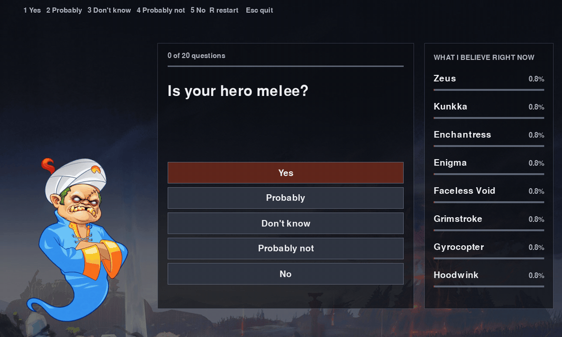
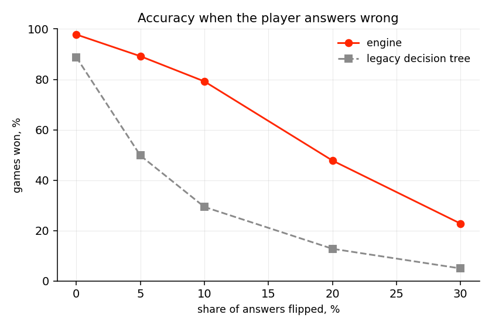
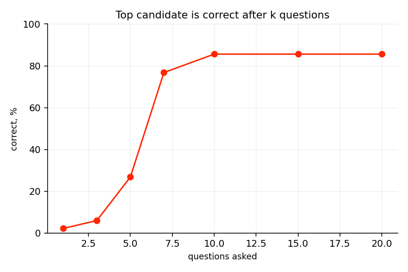
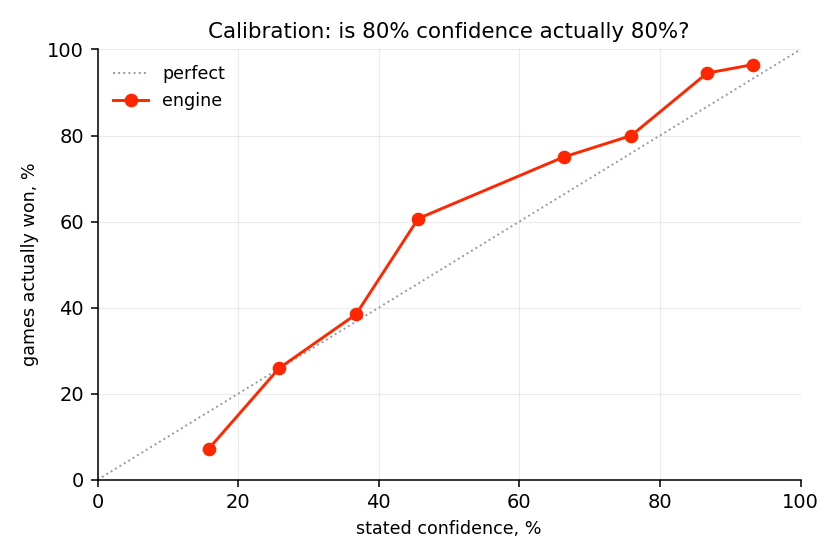

# Dota-Akinator
[](LICENSE)


Guess which of the 127 Dota 2 heroes you are thinking of.

## Preview:



The engine keeps a probability distribution over every hero, asks whichever question
maximises the mutual information between the answer and the hero's identity, and
updates by Bayes with an explicit model of how often players hedge, pass or get it wrong.

Three ways to play:

```bash
pip install -r requirements.txt
python server.py                                        #browser
python play.py                                          #terminal

pip install -r requirements-desktop.txt
python desktop.py                                       #desktop window
```

The browser and desktop clients are the same screen twice. Hero portraits come from the
Steam CDN; the desktop client caches them on disk and plays offline after the first run.
`play.py` is the terminal client, which needs nothing but numpy and takes answers from a
pipe, which is how the regression runs are driven.



## How it works

**State.** A vector `b` over all 127 heroes, uniform at the start, 6.99 bits of entropy.

**Traits.** Each hero has 39 binary traits. A trait can also be unknown, which is not
the same as false: 103 heroes are labelled from the OpenDota API only, so their hand
written traits (undead, robot, carries a sword) are blank. An unknown trait falls back
to the base rate of that column, and the likelihood marginalises over it.

**The answer model.** Five answers, each with a probability given the hero's trait:

```
yes           (1 - idk)(1 - hedge)(1 - eps)     0.727
probably      (1 - idk)(    hedge)(1 - eps)     0.128
don't know     idk                              0.080
probably not  (1 - idk)(    hedge)(    eps)     0.010
no            (1 - idk)(1 - hedge)(    eps)     0.055
```

mirrored when the trait is false, with `eps = 0.07` the chance the player lands on the
wrong side, `hedge = 0.15` the chance they soften a confident answer and `idk = 0.08`
the chance they pass. Every column sums to 1, so the update needs no special cases:

```
P(a | hero) = t * P(a | trait) + (1 - t) * P(a | not trait)
b <- b * P(a | hero),  normalise
```

Two properties fall out of this. `P(don't know)` is the same whatever the trait, so
answering "don't know" leaves the posterior exactly unchanged, which is what an
uninformative observation should do. And an unknown trait lands strictly between the
heroes that have it and the heroes that do not, instead of being silently read as false.

**Choosing the question.** For each unasked question, the mutual information between
the answer and the hero:

```
IG(q) = H(A) - H(A | Hero)
```

and the largest wins. Worth knowing for the interview: with a symmetric noise model and
binary traits the conditional term does not depend on `q`, so this reduces to picking
the most balanced question. The mutual information form is still the one implemented,
because it keeps working once traits are fractional, which here they are.

**A wrong guess.** "Is it Pudge?" is an observation like any other, so
`b[Pudge] *= 0.02` and renormalise. Not zero, because the player may have misclicked,
and not a restart, because everything already learned is still valid.

## Results

500 simulated games per row, fixed seed, `python experiments.py`.

| | honest player | 5% wrong answers | 10% | 20% | 20% "don't know" |
|---|---|---|---|---|---|
| **engine** | **97.8%** in 10.4 q | **89.2%** | **79.2%** | **47.8%** | **91.2%** |
| legacy decision tree | 88.8% in 12.3 q | 49.8% | 29.4% | 12.8% | 54.4% |

The tree is respectable when the player never makes a mistake. It collapses as soon as
one answer is wrong, because a single bad step sends it down a subtree it can never
leave. The distribution just gets a slightly worse update and carries on.



This is one guess after exactly k questions, and it plateaus at 85.6% against a hard
ceiling of 88.2%. Twenty two heroes fall into seven groups with identical trait
signatures, the largest being Crystal Maiden, Keeper of the Light, Rubick, Skywrath
Mage and Witch Doctor, so no question separates them and a single guess inside a group
of five is right one time in five. The engine notices, stops asking once nothing is
worth more than 0.01 bits, and says so rather than guessing at random. The 97.8% in
the table above is higher because a game allows three guesses, which is enough to work
through a tie group.



The curve sits slightly above the diagonal, so the engine is a little underconfident.
That is the assumed `eps = 0.07` being pessimistic about a player who only errs 5% of
the time. `experiments.py` sweeps `eps` and shows the trade directly: against a player
who flips 10% of answers, `eps = 0.03` wins 82.2% in 10.6 questions while `eps = 0.2`
wins 72.6% and needs 17.0.

Hand labelling pays off, and the experiment reports it honestly rather than averaging
it away: the 24 heroes with full manual traits are found 100% of the time in 8.5
questions, the 103 API-only heroes 96.6% of the time in 10.8.

## The data

`build_dataset.py` pulls all 127 heroes from the OpenDota API and derives 16 traits
from primary attribute, attack type, legs and roles. On top of that go 23 hand written
traits covering 24 heroes. The API response is cached in `data/opendota_heroes.json`
so the experiments reproduce without a network.

```bash
pip install -r requirements-dev.txt
python build_dataset.py     # rebuild heroes.csv
python experiments.py       # metrics + results/metrics.json
python plots.py             # the three charts above
pytest                      # engine tests
```

## Layout

| | |
|---|---|
| `engine.py` | belief state, answer model, information gain |
| `data_loader.py` | heroes.csv into a trait matrix |
| `play.py` | terminal client |
| `desktop.py` | pygame client |
| `server.py`, `web/` | stateless Flask API and browser client |
| `baseline.py` | v1's tree walk, headless, for comparison |
| `experiments.py`, `players.py`, `plots.py` | simulation and metrics |
| `legacy/` | v1, kept on purpose |

The web API holds nothing between requests. The client sends its whole answer history,
the server replays it from a uniform prior and returns the next question. Replaying
127x39 costs microseconds and it survives a restart with no session store.

## Legacy
The original is in [`legacy/`](legacy/) and still runs. It trained a
`DecisionTreeClassifier` on a table where each hero appeared exactly once and then
walked `clf.tree_` by hand, which meant the tree memorised rows instead of reasoning
about 20 questions; its Bayesian update set the prior to 1.0 or 0.0 on the answer
itself, so the posterior was identically zero half the time; and both "don't know" and
a wrong guess did `node_index += 1`, stepping to the next slot in the tree array, an
arbitrary node unrelated to the current one.

## Preview legacy:


## License

MIT
